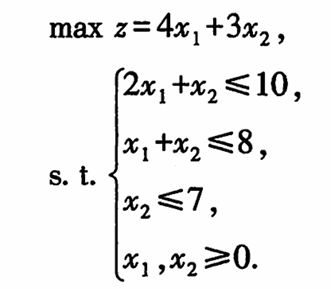
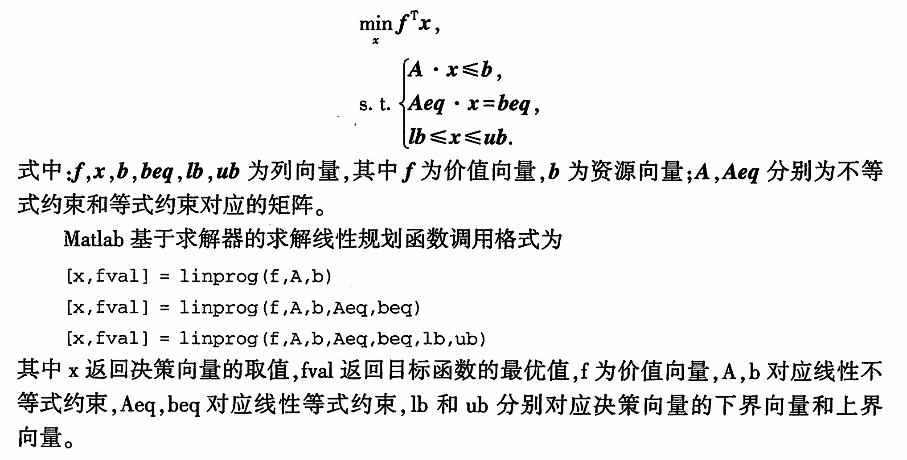
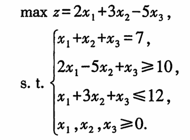

# 线性规划(Linear Programming, LP)

## 0. 问题案例



## 1. MATLAB基于求解器的求解方法



```matlab
clc, clear
c = [4;3]; b = [10;8;7];
a = [2,1;1,1;0,1]; lb = zeros(2,1); %lb=[0;0]
[x,fval] = linprog(-c,a,b,[],[],lb) %没有等号约束
%此处求最大值，标准形式为求解最小值，所以此处加上负号
y = -fval  %目标函数为最大化
```

## 2. MATLAB基于问题的求解方法

```matlab
clc, clear
prob = optimproblem('ObjectiveSense', 'max')
c = [4;3]; b = [10;8;7];
a = [2,1;1,1;0,1]; lb = zeros(2,1);
x = optimvar('x',2,'LowerBound',0);
prob.Objective = c'*x;
prob.Constraints.con = a*x<=b;
[sol, fval, flage, out] = solve(prob)
sol.x  %显示决策变量的值
```


易懂写法：



```matlab
clc, clear
prob = optimproblem('ObjectiveSense','max');
x = optimvar('x',3,'LowerBound',0);
prob.Objective = 2*x(1) + 3*x(2)-5*x(3);
prob.Constraints.con1 = x(1)+x(2)+x(3) == 7;
prob.Constraints.con2 = 2*x(1)-5*x(2)+x(3) >=10;
prob.Constraints.con3 = x(1)+3*x(2)+x(3) <=12;
[sol,fval,flag,out]= solve(prob), sol.x
```

